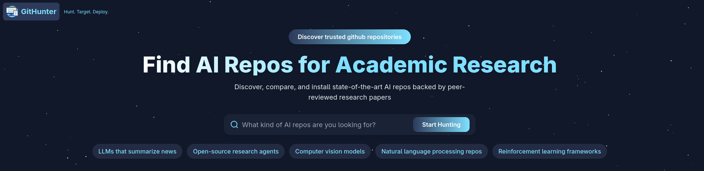
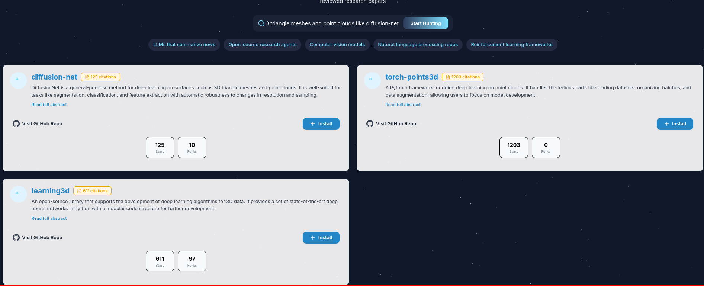
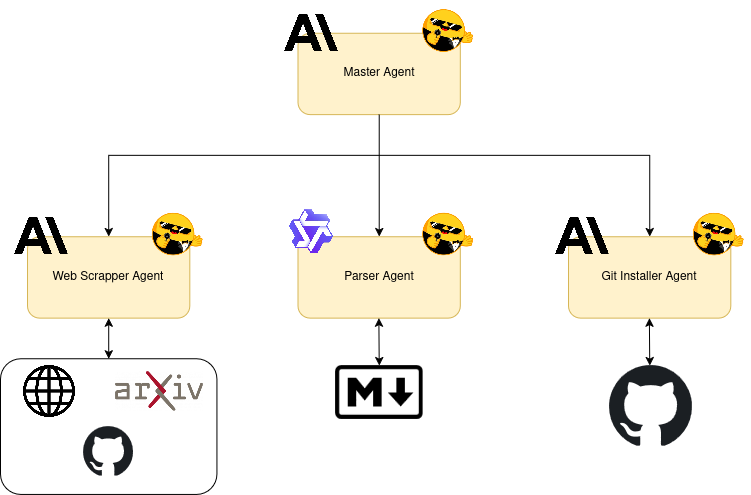

<!-- 🏆 Project Achievement Banner -->
<p align="center">
  <b>🥈 This project won <a href="https://www.linkedin.com/posts/federation-unaite_unaite-is-thrilled-to-team-up-with-hugging-activity-7333807401827004417-BZRH?utm_source=share&utm_medium=member_desktop&rcm=ACoAADJ4pVQBSEvplam5K5-4LgmF-rqYOGWfI0U">2nd place at the Agents Hackathon</a> organised by</b><br>
  
  
  
</p>

<!-- Centered teaser image -->
<p align="center">
  
</p>

<h1 align="center">🚀 <span style="color:#4F8EF7">GitHunter</span>: Multi-Agent Research Assistant 🕵️‍♂️</h1>

<p align="center">
  <b>Discover, compare, and install AI research repositories with ease!</b> <br>
  
</p>

---

# ✨ Features

- 🤖 **AI-Powered Discovery**: Scans thousands of research papers to find the most relevant repositories
- 📊 **Quality Metrics**: Filter by citations, GitHub stars, and recent updates
- ⚡ **One-Click Installation**: Automatic setup of complex research repositories
- 🖥️ **Modern Interface**: Futuristic design with immersive visual effects (starfield, smooth animations)
- 🌗 **Dark/Light Mode**: Theme support for optimal user experience
- 🗣️ **Multi-Agent Communication**: Achieves accurate search through the web, finding the most relevant papers and codebases

---

# 🛠️ Installation

> **Note:** This tool is tested with <b>Python 3.10.18</b> 🐍. Compatibility with other versions is not guaranteed.

1. <b>Clone the repository:</b> 🌀
   ```sh
   git clone https://github.com/henribonamy/hackathon_unaite.git
   cd unaite_def
   ```

## Using uv (Recommended)

[uv](https://astral.sh/uv) is the recommended package installer and virtual environment manager for this project, offering faster installation and dependency resolution.

**Create a virtual environment and install dependencies:** 📦
   ```sh
   uv venv
   source .venv/bin/activate
   uv sync
   ```

## Using pip

If you prefer using pip, follow these steps:

1. <b>(Optional) Create and activate a virtual environment:</b> 🐍
   ```sh
   python3 -m venv venv
   source venv/bin/activate
   ```

2. <b>Install dependencies:</b> 📦
   ```sh
   pip install -e .
   ```
   
   Or if you prefer to install from requirements:
   ```sh
   pip install -r requirements.txt  # If requirements.txt exists
   ```

## Configuration

<b>Create a <code>.env</code> file:</b> 🔑
In the project root, create a file named `.env` and add your Anthropic API key:
```env
ANTHROPIC_API_KEY=your_anthropic_api_key_here
```

---

# ▶️ Running the Project

## With UV (Recommended)

If you installed with UV, run the project with:

```sh
# Make sure your virtual environment is activated
source .venv/bin/activate

# Start the server
python server.py
```

## With pip

If you installed with pip, run the project with:

```sh
# Make sure your virtual environment is activated (if you created one)
source venv/bin/activate  # Skip if not using a virtual environment

# Start the server
python server.py
```

After running the command, open the link shown in your terminal (usually `http://127.0.0.1:1414/`) in your web browser. This will open the GitHunter interface.

---

# 🎬 Demo

To see the search functionality in action, try entering the following prompt in the search bar:

> <kbd>general-purpose method for deep learning on surfaces such as 3D triangle meshes and point clouds like diffusion-net</kbd>

This will list papers related to this topic.

<!-- Centered search result teaser image -->
<p align="center">
  
</p>

After clicking on <b>"install"</b> for a paper, the codebase of the corresponding paper will be installed automatically. ✨

---

# 🧑‍💻 Technologies Used

<p align="center">
  
</p>

This tool is developed using the <b>`smolagents`</b> package by Hugging Face 🤗, and leverages advanced language models including <b>Claude Sonnet 3.7</b> and <b>Qwen 2.54</b> to provide intelligent search and automation capabilities.

---

<p align="center">
  <b>Made with ❤️ for the AI research community!</b>
</p>